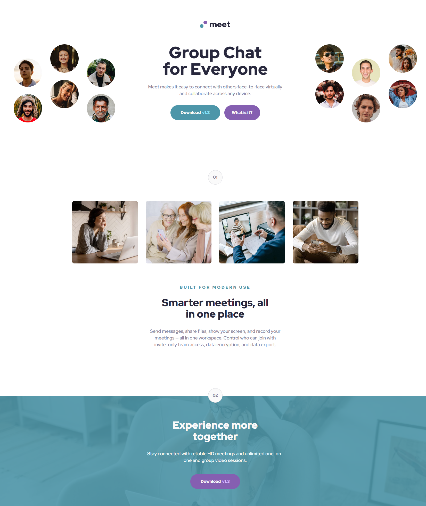

# Frontend Mentor - Meet landing page solution

This is a solution to the [Meet landing page challenge on Frontend Mentor](https://www.frontendmentor.io/challenges/meet-landing-page-rbTDS6OUR). Frontend Mentor challenges help you improve your coding skills by building realistic projects.

## Table of contents

- [Overview](#overview)
  - [The challenge](#the-challenge)
  - [Screenshot](#screenshot)
  - [Links](#links)
- [My process](#my-process)
  - [Built with](#built-with)
  - [What I learned](#what-i-learned)
  - [Continued development](#continued-development)
  - [Useful resources](#useful-resources)
- [Author](#author)

## Overview

### The challenge

Users should be able to:

- View the optimal layout depending on their device's screen size
- See hover states for interactive elements

### Screenshot



### Links

- Solution URL: [URL](https://www.frontendmentor.io/solutions/meet-landing-page-with-scss-HkHiesaV5)
- Live Site URL: [URL](https://miguelzaga.github.io/meet-landing-page/)

## My process

### Built with

- Semantic HTML5 markup
- SCSS
- Flexbox
- Mobile-first workflow

### What I learned

I am proud of the media grid section. I like the responsiveness that resulted from this scss. I am starting to understand better the use of 'clamp()'. I also liked how the group section goes up in the transition from tablet to desktop. I am learning subtle details of responsive design.

```css
.media-grid {
  ... @include breakpoint($md) {
    flex-wrap: nowrap;
    width: rem(689px);
    margin: 0 auto 0 auto;
  }
  @include breakpoint($md-lg) {
    width: clamp(rem(689px), calc(689px + 100vw - $md-lg), rem(1110px));
  }
}

.media-grid__img {
  ... @include breakpoint($md) {
    max-width: rem(164px);
  }
  @include breakpoint($md-lg) {
    max-width: none;
    width: clamp(rem(164px), calc(164px + (100vw - $md-lg) / 5), rem(255px));
  }
}
```

### Continued development

I think that there is much to learn about background images and layouts that I am still lacking. I am sure there must be better ways to organize them and implement them. I am happy with the result of this project. I was looking back at the first projects and they had terrible flaws in the layout, in terms of the HTML structure and the CSS. I think I am gettin better at organizing the HTML structure but I think I could be much better.

### Useful resources

- [Hexadecimal color code for transparency](https://gist.github.com/lopspower/03fb1cc0ac9f32ef38f4) - Helped me find a color for the border of the separators so I didn't have to do complicated maneuvers to avoid the children to be affected by opacity.
- [Injecting a Line Break](https://css-tricks.com/injecting-line-break/) - It helped me inject a line break so that the text in mobile would look like the design in a certain section.
- [How To Edit Your Commits with 'git commit --amend'](https://smartlogic.io/blog/git-commit-amend/) - Very handy git command that I learned, haha made a bunch of mistakes in commits and was able to change them.
- [cursor](https://developer.mozilla.org/en-US/docs/Web/CSS/cursor) - I did not know you could set up this property so that it looks better when you hover over a button, I added it to the buttons of the page.

## Author

- Frontend Mentor - [@miguelzaga](https://www.frontendmentor.io/profile/miguelzaga)
- Linkedin - [Miguel Zapata](https://www.linkedin.com/in/miguelzaga/)
